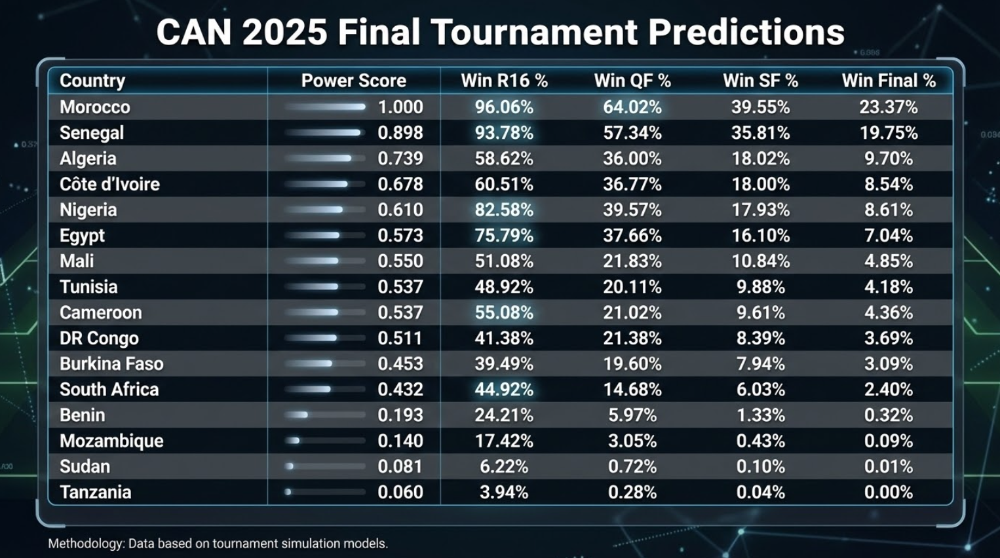

# AFCON 2025 Predictor: A Luck-Adjusted Monte Carlo Simulation

This repository contains a **dual-script engine** designed to predict the winner of the **2025 Africa Cup of Nations (AFCON)**.  
Unlike standard simulators, this project **quantifies "luck"** using historical event data and applies a **dynamic variance model** based on the **strength gap** between teams.

---

## Methodology

The project is built on the philosophy that football outcomes are a mix of **structural strength (stats)** and **stochastic noise (luck)**.

- **Luck Quantification:** We analyze the *"Swing"* between **Expected Goals ($xG$)** and actual goals from thousands of professional matches.
- **Power Scoring:** Teams are ranked using a **multi-factor weighted index**: **Elo Ratings**, **FIFA Rankings**, **Market Value**, and **Recent Win Rates**.
- **Dynamic Simulation:** A Monte Carlo engine runs **10,000** iterations of the tournament, where the influence of luck is **inversely proportional** to the power gap between two teams.

---

## Project Structure

### 1) Data Mining & Luck Analysis (`Luck_rate.py`)

This script interfaces with **StatsBomb Open Data** to establish a baseline for footballing randomness.

- **Feature Extraction:** Standardizes event data (**Shots**, **$xG$**, **Outcomes**) across different competition formats.
- **Luck Metric:** Calculates a `luck_match_pct` based on the deviation between a team's **finishing efficiency** and their **$xG$**.
- **Output:** Produces `luck_rates_2020_today.csv`, a distribution of historical "chaos" used to calibrate the simulator.

---

### 2) Tournament Simulator (`predict_lucky_rate.py`)

The prediction engine that simulates the AFCON bracket from the **Round of 16**.

#### Weighting System
- **Elo (38%)**  & **FIFA (17%)**: Technical and historical ranking
- **Market Value (23%)**: Squad depth and talent quality
- **Win Rate (22%)**: Current momentum based on recent history (last 5 years)
ELO ratings: https://lnkd.in/esw4abxa
FIFA ranking: https://lnkd.in/eNQ4ccxG
Squad market values (Transfermarkt): https://lnkd.in/e3MYe6hB
International match results dataset: https://lnkd.in/ePrF-DqH

#### Match Engine
- Uses a **Poisson Distribution** where the **$\lambda$ (expected goals)** is adjusted by a **"Luck Shrinkage"** factor.
- **Luck Shrinkage:** In matches with a massive power disparity, the model reduces the luck variance to reflect higher predictability.

---

##  Technical Features

- **Monte Carlo Simulation:** **10,000** runs to ensure statistical significance of probabilities.
- **Robust Name Mapping:** Integrated cleaning tool to handle variations in country names  
  (e.g., `"DR Congo"` vs `"Congo DR"`) across datasets.
- **Penalty Simulation:** Tie-breakers are modeled using a **Sigmoid function** based on team strength and an increased "stress" variance factor.

---

## How to Run

### Prerequisites
```bash
pip install statsbombpy pandas numpy openpyxl
```

### Data Setup

Ensure the following files are in the root directory (the scripts automatically load the **first file** matching each prefix):

- `1.*` : Historical match results  
- `2.*` : Team market values  
- `3.*` : Elo ratings  
- `4.*` : FIFA rankings  

> Tip: you can use `.csv` or `.xlsx` — just keep the prefix naming convention.

### Execution

1) **Generate the luck pool** (optional if `luck_rates_2020_today.csv` is already in the repo):
```bash

```bash
python Luck_rate.py
```

Run Prediction:

```bash
python predict_lucky_rate.py
```

Results Preview

The model outputs a detailed probability matrix for each team, from the Round of 16 through to the Final, helping identify dark horses versus statistical favorites based on bracket path.
```bash
::contentReference[oaicite:0]{index=0}
```

### Results (Preview)


